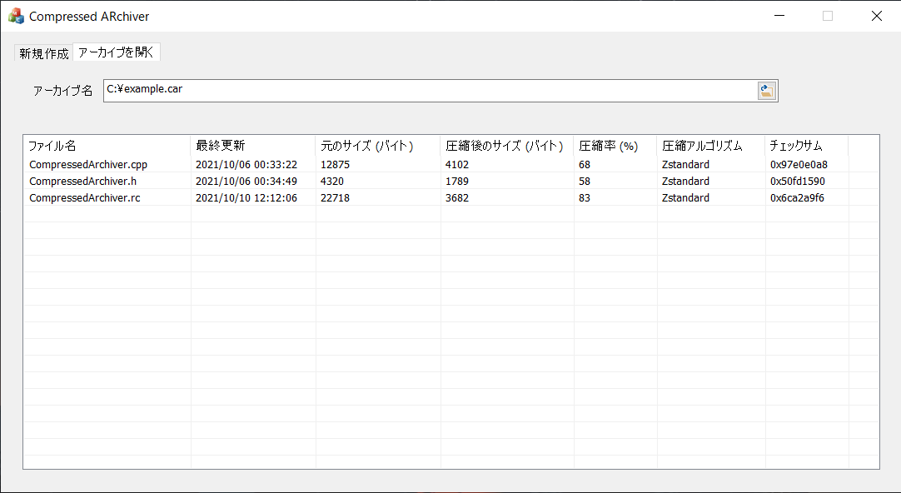

# Compressed Archiver
アーカイブパッケージマネージャーです。



## 機能
* アーカイブ機能
  * 対応アルゴリズム
    * ZIP
    * XPRESS
    * XPRESS + ハフマン
    * LZMS
    * LZ4
    * Zstandard
  * xxHashによるチェックサム
* アーカイブ内のリスト表示

## 開発環境
Visual Studio 2019 Community
* C++によるデスクトップ開発
  * MFC

依存ライブラリ
* xxHash
* LZ4
* Zstandard
```cmd
git clone https://github.com/Microsoft/vcpkg.git
cd vcpkg
bootstrap-vcpkg.bat
vcpkg integrate install
vcpkg install xxhash:x64-windows-static
vcpkg install lz4:x64-windows-static
vcpkg install zstd:x64-windows-static
```
## ファイルフォーマット
CARファイルのフォーマットは以下の通りです。
```
+---------------+
|   ヘッダー1    |
+---------------+
|    データ1     |
+---------------+
|   ヘッダー2    |
+---------------+
|    データ2     |
       .
       .
       .
+---------------+
```

### ヘッダーフォーマット
各ファイルの情報を格納するヘッダーのフォーマットは以下の通りです。

```
    X bytes        1 byte         4 bytes          4 bytes         8 bytes        4 bytes
+=============+---------------+--------------+-----------------+-------------+---------------+
|  ファイル名　|  圧縮メソッド  |  元のサイズ  |  圧縮後のサイズ  |  最終更新日  |  チェックサム  |
+=============+---------------+--------------+-----------------+-------------+---------------+
```

* ファイル名
   * 任意の長さ。ヌル文字まで読み取りそれをファイル名とする。
* 圧縮メソッド
   * 1バイト。使用している圧縮アルゴリズム（[対応アルゴリズム](#機能)）。
* 元のサイズ
   * 4バイト。圧縮前のファイルサイズ。
* 圧縮後のサイズ
   * 4バイト。圧縮後のファイルサイズ。
* 最終更新日
   * 8バイト。Windowsの[FILETIME](https://docs.microsoft.com/en-us/windows/win32/api/minwinbase/ns-minwinbase-filetime)の仕様に従う。
* チェックサム
   * 4バイト。xxHashによるファイルのチェックサム。
   